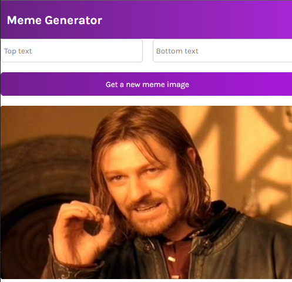

## Meme Generator Project
this is a project i made using React.
it fetches a random meme image from the imgflip api, and, allows you to add text to said image.

### What i learned while making the project:
+ Responsive Design
+ How to handle Forms in React
+ Event handling in React
+ the useEffect React hook
+ Api calls (using the fetch api)
+ Conditional rendering
